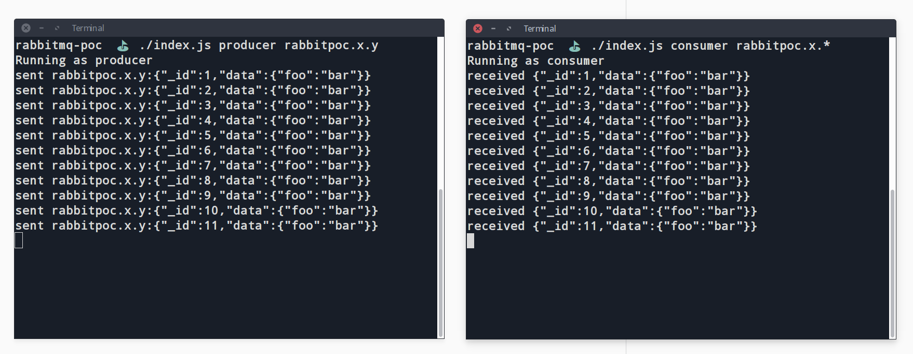

# RabbitMQ POC

**Why:** To play around with RabbitMQ and quick test scenarios to find out the fit for specific projects.

**What:** CLI program to test topic exchanges settings such as queue auto-delete, x-expire, etc. The idea is to have a quick example to tweak settings and quickly test scenarios.

---------------------------------



## Concepts

Learn more about RabbitMQ: [rabbitmq.com/getstarted.html](https://www.rabbitmq.com/getstarted.html)

Comparison with Apache Kafka: [pivotal.io/rabbitmq/understanding-when-to-use-rabbitmq-or-apache-kafka](https://content.pivotal.io/rabbitmq/understanding-when-to-use-rabbitmq-or-apache-kafka)

## Getting started / Prerequisites / Dependencies

First of all, make sure that you have a RabbitMQ server running on `localhost:5672`. The easier way to do that is throught docker:

```
# Run rabbitmq server
docker run --rm --hostname my-rabbit --name some-rabbitmq -p 5672:5672 rabbitmq:3
```

Use the `./index.js <role> [topic]` as a entry point. Initialize multiple terminal instances in order to be able to see the message delivery.

```
# Run producer
./index producer rabbitpoc.type.message

# (In a second terminal) run the consumer program
./index consumer rabbitpoc.type.*
```

Fell free to run multiple consumers, stop, start services and play around with the code.
